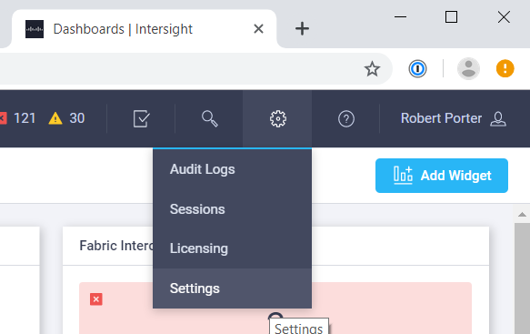
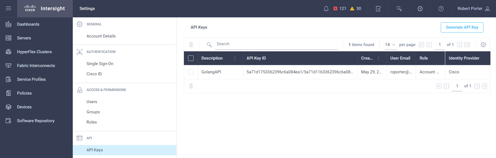
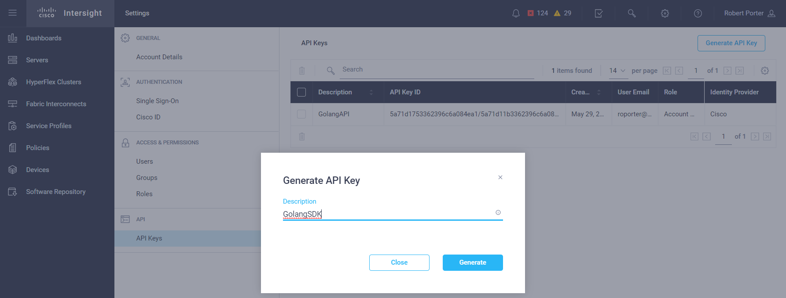
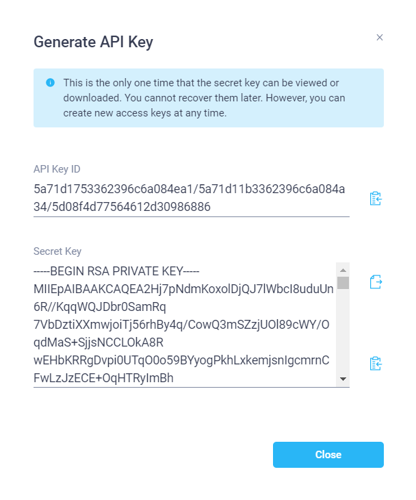
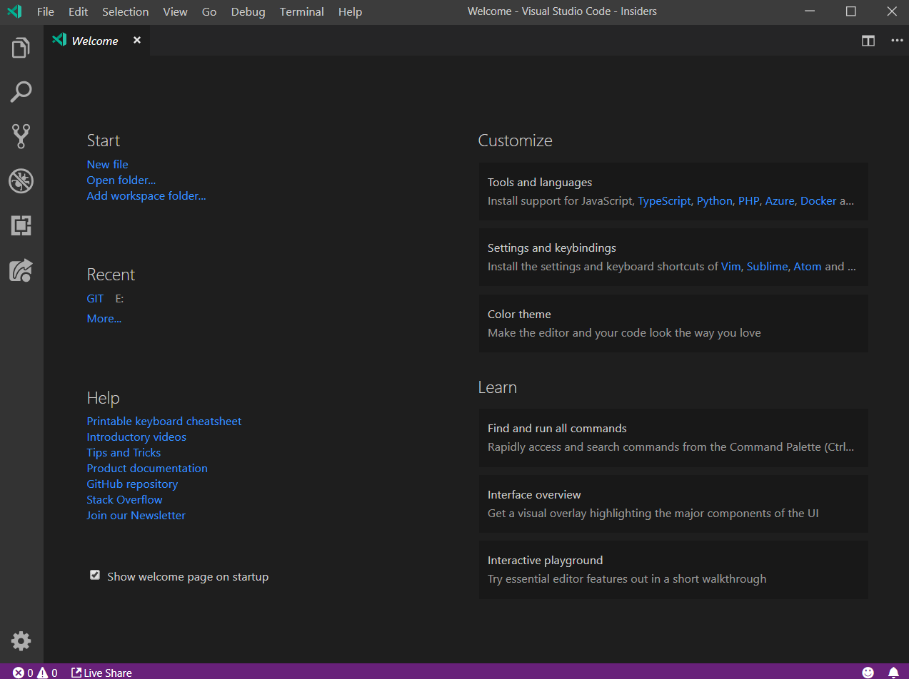
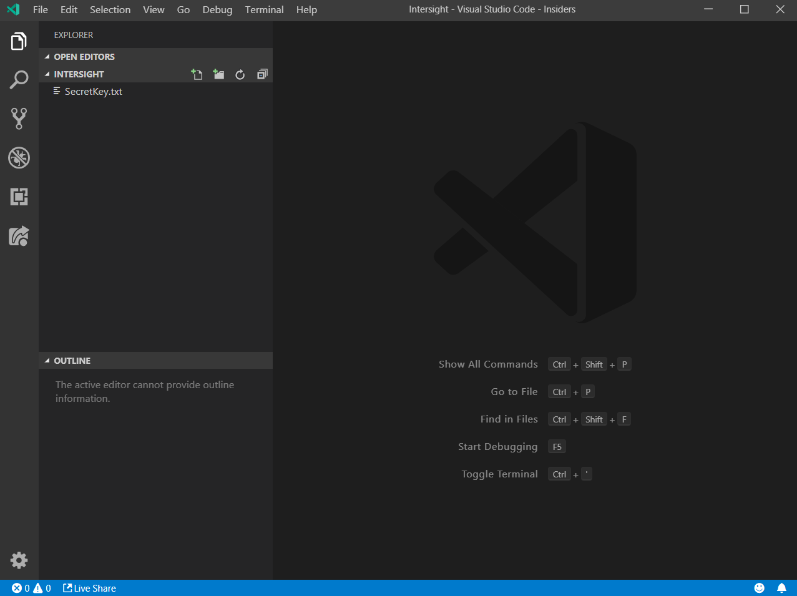
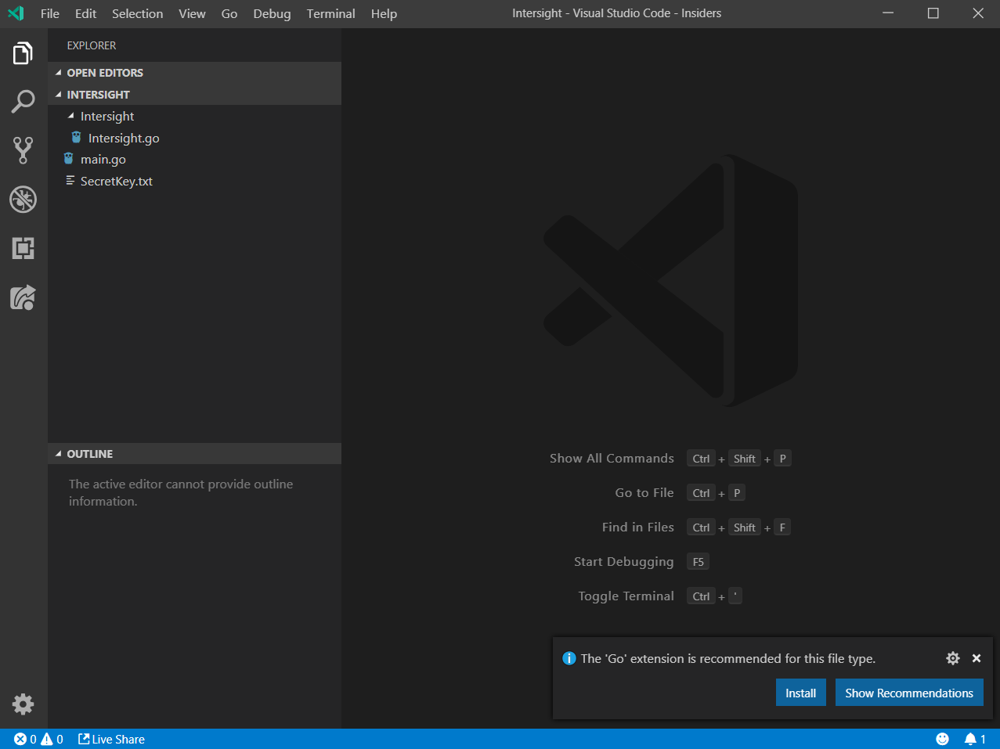

Cisco Intersight

# Cisco Intersight

# Overview
Python is a great and very popular scripting language, especially amongst the growing DevOps teams.  It is therefore very common to find many SDK's developed in Python, however, it is also common to find these teams using other languages, such as Go.

In this initial tutorial, we will go through the process step by step of reverse engineering the Cisco Intersight Python SDK into a Go version.

In future tutorials we will extend this functionality and make some real life customer API to short cut common requirements and produce a Web frontend / dashboard to display our API information.

# Tools
To run through this tutorial we will use a number of tools to achieve our goal, many of the screenshots and tools will reference a Mac, however, the steps, tools and goals can all be achieved on Windows and Linux too.

We will need;

-	**Golang** - Any version should support what we are doing, however, you should always try to run the most recent version if possible.  As of writing this Go is version 1.12.6.
[Golang](https://golang.org/)
-	**Visual Studio Code** - This is my preferred IDE, however, there are no specific tools that we will use that are unique to VSCode.  If you prefer Sublime, IntelliJ, TextEdit, they will all work fine, however the screenshots in this tutorial will not match.  As of writing VSCode is version 1.35.0.
[Visual Studio Code](https://code.visualstudio.com/)
-	**Internet Connection** - The Github repository, but more so Intersight itself is a SaaS tool and so having an active and reliable internet connection is required.
[Internet](http://amionline.net/)
-	**A terminal** - Any terminal or command prompt should suffice.  This will be used for executing our application at multiple stages and for displaying the output.  I will be using iTerm, however, the standard terminal or command prompt would be fine.  As of writing this iTerm is version 3.3.0
[iTerm](https://www.iterm2.com/version3.html)

# 1. Starting Point
There are many places to start our journey, we could jump into the code, we could step through installing the tools, storyboarding, and many other steps.  However, the best place to start is to review some working code that has been written and tested and will be what we reverse engineer into Go code.

At this pointing understanding the ins and outs of the Python script is not required.  If you do have some background in Python that will be advantageous, but not a necessity.

We will start by looking here, this is the main repository for the REST interface;
[Cisco UCS Intersight Rest repository](https://github.com/CiscoUcs/intersight-rest)

We can then explore the specific repository for the Python code;
[Cisco UCS Intersight Python main page](https://github.com/CiscoUcs/intersight-rest/tree/master/python)

And finally we can look at the piece of Python code we will reverse engineer;
[Cisco UCS Intersight Python code](https://github.com/CiscoUcs/intersight-rest/blob/master/python/intersight_rest/intersight_rest.py)

Spend some time looking at the code and understanding the different functions (in Python these start with the word *def*).  The real function, the one that brings all of the different functions together and the one that actually does the API call is the function *def intersight_call*.  Have a look at this function and the flow.

We will spend more time on the specifics, however for now, anything that is not clear or any new Python command, have a quick look online to understand what it is doing.

# 2. Create a new folder
We will need a folder to develop in and to store our keys from the next step.  Create this folder anywhere you wish, i will create mine on the desktop for ease.

# 3. Certificate
One of the first steps we need to complete is to request our certificate or API key from Intersight.  Therefore the first thing is to login into Intersight;

1) Login into [Intersight](https://intersight.com)
2) Select the account you wish to query via API.  In this tutorial we will query only one account, however you an easily extend to query multiple accounts once complete.

3) Once the dashboard appears, please select the cog and then Settings;

4) Then select "API Keys" from under API on the Settings screen.

5) Click "Generate API Key" and enter a description for the new key.

6) Once happy click "Generate" and a new window will open.

7) Although it does warn you in the blue box, the "Secret Key" is only displayed once and we need this to achieve anything with the API, so at this point, click on the 2nd icon down on the right hand side, this will save the private key to disk, save or move this to the folder you created.  Also make sure to copy and saev the API Key ID as we also need this (This one we can get again though).

At this point we have done all the prep we need to start looking at some code.

# 4. Creating our structure
Lets start Visual Studio Code.

1) Click on "Open Folder..." and open the folder we previously created.

2) You should be able to see the SecretKey.txt from the previous step.
3) Next create folders and files that match the following.  Note main.go is at the folder route level and Intersight.go is inside the Intersight folder.

4) You would have noticed a popup appear as soon as you created a folder with the extension .go.  Go ahead and install the extension.
5) After a few minutes the extension will be installed, click on the top icon in the left column to return to the code screen.

We now have the shell of our application created.  The main.go will be our test harness for the code that will be inside the Intersight folder.  Coding in this way will allow use to create a stand alone package of the Intersight folder that we will be able to consume in multiple different apps moving forward.

# 5. Starting to code